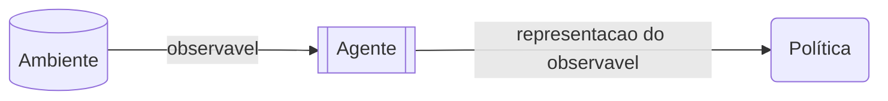
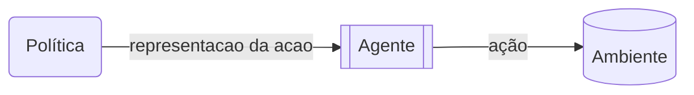

# O que é aprendizagem por reforço

Certo, ainda não discutitmos a abordagem por reforço e nem por que ela é importante para os jogos. Na verdade, vamos discutir o que é aprendizagem por reforço e como ela funciona em dois tipos de problemas.

* Replicar o comportamento: Construímos um agente que molda seu comportamento ou criar um comportamento para o modelo se baseando nos diversos comportamentos de um grupo de diversas pessoas. Esse é o caso em que usamos IA para criar o oponente de um jogo.
* Construir um sistema de controle automatizado: nesse caso, o agente de reforço aprende a lidar com um cenário que lhe foi apresentado, por exemplo, um sistema de reforço para fazer ou desfazer investimentos uma carteira de ações.

## O fluxo
De forma bem resumida, o objetivo de problema de reforço é treinar um modelo (também chamado de *política*), que vai orientar um agente na decisão qual a melhor ação a ser tomada diante de um dado cenário (chamado de *observável*).

O fluxo consiste em:

1. O *agente* recebe do *ambiente* um *observável*, com informações do seu *estado* atual. Com o *observavel* em mãos, o agente constroi a representação[^1] que deve ser enviadas para a *política*, que decide qual a melhor *ação* a ser aplicada no ambiente e a representação equivalente.

2. A representação da ação enviada pela política é convertida numa ação efetiva pelo agente, ação essa que é aplicada ao ambiente.

A ação aplicada pelo agente, pode alterar o *estado* do ambiente, gerando um novo observável e mantendo o ciclo.

Um ponto importante é que o ambiente pode ter uma evolução natural, ou seja, o ambiente pode mudar mesmo se o agente não fizer nada. Isso significa que o *observável* coletado do ambiente é na verdade função do tempo! Alguns exemplos que podem deixar esse conceito mais claro:

* No jogo space invaders:
> Os inimigos se movimentam e atiram contra o jogador. Independentemente de qual ação o jogador tomar (mover para a direita ou esqueda, disparar contra os inimigos, ou não fazer nada) os movimentos continuarão ocorrendo.
 
* Num bot para gerenciar carteiras de investimentos:
> O preço das ações continua variando devido a "fatores externos", como por exemplo, outros investidores. O comportamento dos outros investidores é totalmente ignorado pelo agente, mesmo que não faça nada, o estado do ambiente continua variando.
* Num jogo de paciência (cujas regras podem ser vistas [nesse link da wikipedia](https://pt.wikipedia.org/wiki/Paci%C3%AAncia_(jogo))
> o estado do jogo só muda quando o jogador toma uma ação sobre as cartas, essé um exemplo onde alterações no ambiente dependente apenas do seu estado inical e das ações tomadas pelo agente.

## Os componentes

Algumas palavras estão marcadas, elas representam elementos importantes do universo da aprendizagem por reforço, vamos a elas. Nesses eemplos você teve uma visão conceitual da função dos componentes, agora vamos a algo mais formal: 

### Política:

A política é o modelo que define as ações a serem tomadas pelo ambiente a partir da representação que recebe do observável. Esse é efetivamente o modelo de IA que foi treinado e está envolvido na história toda.

### Agente

O agente é aquele que faz a interface entre entre a política e o ambiente, em ambos os sentidos. Agentes diferentes são aplicados a diferentes ambientes de produção que contém um mesmo modelo de política. Um modelo de carro autônomo pode ser treinado num ambiente virtual, onde não existe risco de ferir alguém em caso de acidente e onde pode-se criar várias situações pouco prováveis no mundo real. O modelo treinado pode ser usado num carro autônomo real, nesse caso o agente é diferente: agora, em vez de sinalizar no simulador que o veículo acelerou, feou ou a direção para a qual está se movendo, ele deve enviar sinais elétricos para o sistema de direção do carro, além disso, agora o observavel recebido pelo agente não são mais imagens de um cenário fictício, que roda num simulador, mas imagens de uma camera. Amboso os agentes, no simulador e no mundo real, sabem como traduzir o observável para um formato compreendido pela política, assim, uma placa de pare do simulador, deve gerar o mesmo vetor (representação) que uma placa de pare filmada pela câmera no mundo real.

Perceba que a política não se importa em como o agente executa as ações definidas e nem como ele obtém a representação do observável, ou seja, para a política o ambiente é uma caixa-preta[^2]. 

### O Ambiente

O ambiente é o elemento que fornece os observáveis para o agente e contém a dinâmica do problema. Pode ser de duas formas:

* Uma forma que sabe as regras que modificam seu estado interno, de forma autônoma e/ou baseado nas ações tomadas pelo agente. Por exemplo, o motor de gameplay para um jogo sabe como modificar o seu estado (posção dos inimigos, pontuação, posição do personagem controlado pelo jogador, vidas restantes e vidas ganhas etc)
* Uma forma que sabe como conseguir os dados do seu estado interno atual. Num problema para gestão de uma carteira de investimentos, o ambiente sabe os valores atuais e parte dos valores passados de todos os ativos daquela carteira (ações por exemplo), mas ele não sabe como alterar os valores, e sim como obtelôs, por exemplo, estando conectado a às APIs da bolsa de valores para obter o valor das ações a cada minuto, e conectado às APIs do banco que sabem fornecem a quantidade de recursos disponíveis para investir após cada ação de investimento.

Veja que em ambos os casos, o agente não precisa saber como o ambiente consegue o observável e nem como ele processa as ações, do ponto de vista do agente o ambiente é uma caixa-preta.

### Estado

O estado, ou mais detalhadamente, estado interno do ambiente, é toda e qualquer informação que faça sentido no ambiente para mudar seu observável ou a forma como responde às ações do agente. Num jogo, o estado pode conter, as informações de pontuação de cada jogador, a posição de cada personagem ou item de cenário, os níveis de dado e defesa de cada personagem etc. No sistema de investimento, o estado pode conter os valores atuais das ações, a quantidade de dinheiro nas carteira do cliente, os valors de taxas de compra, etc.

### Observável

O observavel é a informação que o agente recebe do ambiente. Muitos o confundem com o estado, mas na verdade o observável pode tanto ser o estado completo, como pode consistir de apenas parte das informações contidas nele.

* no caso de um jogo:
> não necessariamente o agente precisa conhecer tudo do estado: ele sabe sua posição atual e sua pontuação, mas não precisa necessariamente saber a localização de itens ocultos, que é uma informação do estado, mas só estará disponível como observável quando o jogador chegar na posição do item; o jogador pode saber a posição de um inimigo, mas não necessariamente seus poderes de ataque ou de defesa, ou seja, são informações contidas no ambiente, que fazem parte do estado, mas não são disponibilizadas no observável.

* No caso de um agente de investimentos
> o agente sabe o valor histórico das ações e seu valor atual, isso consiste no observável. Mas existem outras coisas que afetam o valor das ações como o número de pessoas investindo e o valor que elas investem, isso é totalmente oculto para o agente de investimento, então não faz parte do observável, mas faz parte do estado interno.

Do ponto de vista da política, o observável é um objeto matemático (um vetor, tensor, matrix, etc) conténdo os dados que devem ser processados pelo modelo. Do ponto de vista do agente, o observável é qualquer objeto contenedor de dados, uma lista, um dicionário, uma classe, etc. o Agente sabe como aplicar todas as transformações no observavel recebido do ambiente para construir o observável que será enviado pra política.

### Ação

A ação é, como o nome diz, ação realizada pelo agente. Num jogo existe um conjunto de ações limitadas como mover-se para esquerda ou direita, pular, acelerar, desacelerar, lançar um golpe, etc. As ações possíveis dependem do problema que está sendo tratado. Por exemplo, no caso do agente de investimentos, as ações podem ser

* Aplique o valor $v$ no ativo $i$
* Resgate o valor $v$ do ativo $i$
* Não faça nada

Ou em lugar de aplicar as alterações a uma ação por vez, o agente pode alterar toda a carteira, por exemplo, numa carteira de 3 ativos:

* Aplique os valores $(v_1, v_2, v_3)$ respectivamente às carteiras $(i, j, k)$
* Não faça nada

Nesse último caso, as aplicações e resgates são feitos em conjuntos, e aplicações negativas seriam equivalentes a resgates.

Assim como o observável, do ponto de vista da política, a ação é representada como um objeto matemático, mas do ponto de vista do agente, ele é uma ação a ser tomada sobre o ambiente, assim sendo, ela é uma função ou parâmetros de uma função que definem a ação a ser tomada com os dados a serem aplicados. Como por exemplo, mover um carro 10 graus no sentido anti-horário.

[^1]: O termo representação é usado para indicar o formato usado pelo seu sistema de IA para processar os dados. O observável pode ser recebido como um objeto JSON numa API, o agente é responsável por traduzir esse objeto em uma represtação compreendida pelo modelo da política. Isso inclui fazer todas as transformações de feature engineering nessárias e converter o resultado num vetor, que será dado de entrada na política. Da mesma forma, a política retorna uma representação da ação a ser tomada (um vetor por exemplo) que precisa ser convertido na ação efetiva a ser tomada, no caso de um jogo, seria algo como enviar um comando para acelerar ou frear.

[^2]: O termo caixa-preta é usado no mesmo sentido da segregação de responsabilidades de software. Isso quer dizer que a forma como as coisas funcionam internamente no componente A não é importante para o componente B, contanto que a forma como eles interagem seja bem definida.
